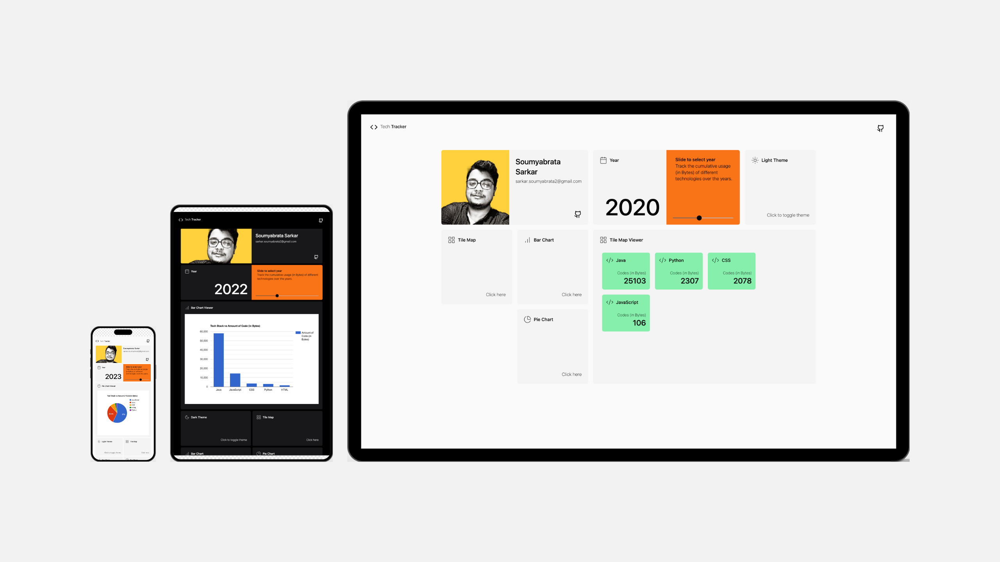

# Tech Tracker App



## Overview

The **Tech Tracker App** allows users to track the technologies they have used throughout a specific year, along with the **amount of code (in Byte)** they have written for each technology. The app provides a visual representation of this data using **Google Charts** and allows interaction via a **React** frontend. The backend is built with **Express.js** and **Node.js** and integrates with the **GitHub API** to fetch relevant data.

- **Live Link** :
  https://tech-tracker-app.azurewebsites.net/tracker

### Features

- Track technologies used in a given year.
- Input the number of lines of code written for each technology.
- Visual representation using **Google Charts** to display the data.
- RESTful API for backend interactions.
- Integrated with GitHub API to fetch data related to technologies used in the year.

## Tech Stack

- **Frontend**:
  - **React.js** for building the user interface.
  - **Google Charts** for visualizing the data.
- **Backend**:
  - **Express.js** for building the REST API.
  - **Node.js** as the runtime environment.
  - **GitHub API** integration to fetch data related to technologies used in the year.

## Overview

The **Tech Tracker App** allows users to track the technologies they have used throughout a specific year, along with the **lines of code** they have written for each technology. The app provides a visual representation of this data using **Google Charts** and allows interaction via a **React** frontend. The backend is built with **Express.js** and **Node.js** and integrates with the **GitHub API** to fetch relevant data.

- **Live Link** :
  https://tech-tracker-app.azurewebsites.net/tracker

### Features

- Track technologies used in a given year.
- Input the number of lines of code written for each technology.
- Visual representation using **Google Charts** to display the data.
- RESTful API for backend interactions.
- Integrated with GitHub API to fetch data related to technologies used in the year.

## Tech Stack

- **Frontend**:
  - **React.js** for building the user interface.
  - **Google Charts** for visualizing the data.
- **Backend**:
  - **Express.js** for building the REST API.
  - **Node.js** as the runtime environment.
  - **GitHub API** integration to fetch data related to technologies used in the year.
- **Docker**:
  - Dockerized app for easy deployment.

## Running the Application

We can run this application by cloning the repository code and manually start node services or to quickly set up and run the application with Docker, you can use **Docker Compose** to start both the frontend and backend services together.

### 1. Manually Start the Application

### Prerequisites

Before proceesing, ensure you have NodeJS installed

- **Node JS**: Installation guide.
  - [Link](https://nodejs.org/en)

First, clone the repository (or download the codebase) to your local machine.

```bash
git clone https://github.com/scode24/Tech-Tracker-App.git
cd tech-tracker
```

Go to backend folder

```bash
cd backend
```

Create and add github access token in .env file

```
GITHUB_ACCESS_TOKEN = <your_github_access_token>
```

To run backend service

```bash
node app.js
```

To run frontend service

```bash
cd .. # back to main folder tech-tracker
npm start
```

### 2. Running with Docker Compose

This guide will walk you through the steps to run your application using **Docker Compose**.

### Prerequisites

Before running Docker Compose, ensure you have the following installed:

- **Docker**: To manage and run containers.
  - [Download Docker](https://docs.docker.com/get-docker/)
- **Docker Compose**: To manage multi-container Docker applications.
  - [Install Docker Compose](https://docs.docker.com/compose/install/)

You can check if Docker and Docker Compose are installed by running the following commands:

```bash
docker --version
docker-compose --version
```

### Docker Compose Configuration

This is the Docker Compose configuration for running a **frontend** and **backend** service.

#### docker-compose.yml

```yaml
version: "3.8"

services:
  backend:
    image: soumyabrata024/tech-tracker-app-backend:latest
    container_name: tech-tracker-app-backend
    ports:
      - "7001:7001"

  frontend:
    image: soumyabrata024/tech-tracker-app:latest
    container_name: tech-tracker-app
    ports:
      - "3000:3000"
    depends_on:
      - backend
```

To start the containers in detached mode (in the background), run the following command:

```bash
docker-compose -f docker-compose-file.yml up -d
```

## Access Tech Tracker

```
http://localhost:3000
```
